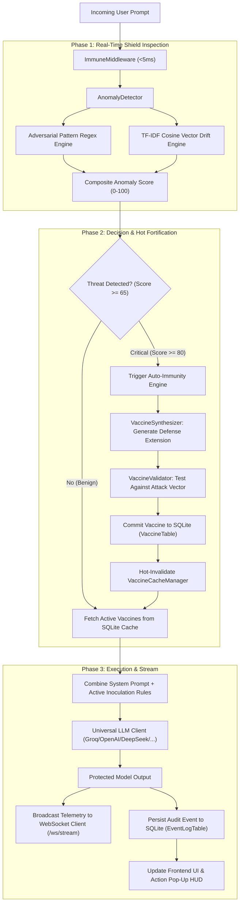

# VaxGuard: Master Product Report & Technical Architecture Reference

**Product Name:** VaxGuard — Autonomous AI Immune System  
**Version:** 0.1.0 Enterprise Edition  
**Repository:** [https://github.com/pradeepkumar-ai-byte/VaxGuard](https://github.com/pradeepkumar-ai-byte/VaxGuard)  
**System Type:** Real-Time Adaptive LLM Firewall, Vulnerability Scanner & Self-Healing Immunology Engine  
**UI Paradigm:** Physical Dark Midnight Mountain Glassmorphism (VisionOS / macOS Sequoia Aesthetic)  

---

## Executive Summary

**VaxGuard** is an enterprise-grade, autonomous biological immune system engineered specifically for Large Language Models (LLMs). Traditional AI security relies either on brittle regex filters or slow secondary LLM guardrails (which add 800ms–2500ms of latency). 

VaxGuard introduces **biological immunology to artificial intelligence**:
1. **Real-Time Anomaly Detection (<5ms latency)** combining heuristic threat pattern matching with mathematical TF-IDF semantic vector cosine drift calculation.
2. **Autonomous Zero-Day Self-Healing**: When a novel exploit slips through or exhibits critical anomaly drift (\(\ge 80/100\)), VaxGuard intercepts the attack, synthesizes an adaptive defense prompt extension, rigorously validates it against the vector, and hot-deploys it into memory cache with **zero model downtime**.
3. **Universal Multi-Provider Engine**: Supports Groq (with round-robin key balancing), OpenAI, Anthropic Claude, Google Gemini, DeepSeek, Mistral AI, Together AI, and Local LLMs (Ollama, vLLM, LiteLLM) via runtime switching.
4. **Physical Frosted Glass UI**: Featuring high-definition midnight mountain scenery, reflective top shimmer bevels, real-time WebSocket telemetry, interactive diagnostic scanners, an adversarial sandbox, and a **Real-Time Action Pop-Up HUD** that displays instant feedback for every single user interaction.

---

## Complete Multi-Provider & Model Catalog

VaxGuard features a universal, runtime-swappable LLM execution layer (`vaxguard/core/llm_client.py`). It connects to **8 provider ecosystems** and **29+ pre-configured models**, plus infinite local/custom model write-ins:

| Provider | Base URL | Default Model | Pre-configured Models Supported | Authentication |
|---|---|---|---|---|
| **Groq** | `https://api.groq.com/openai/v1` | `qwen/qwen3.8-27b` | • `qwen/qwen3.8-27b`<br>• `llama-3.3-70b-versatile`<br>• `llama-3.1-8b-instant`<br>• `gemma2-9b-it`<br>• `mixtral-8x7b-32768`<br>• `deepseek-r1-distill-llama-70b` | Round-Robin Multi-Key Pool (`GROQ_API_KEY`, `GROQ_API_KEY_2`, `GROQ_API_KEY_3`) |
| **OpenAI** | `https://api.openai.com/v1` | `gpt-4o-mini` | • `gpt-4o`<br>• `gpt-4o-mini`<br>• `gpt-4-turbo`<br>• `gpt-3.5-turbo`<br>• `o1-preview`<br>• `o1-mini` | Bearer Token (`OPENAI_API_KEY` or modal input) |
| **DeepSeek** | `https://api.deepseek.com/v1` | `deepseek-chat` | • `deepseek-chat`<br>• `deepseek-reasoner` (R1) | Bearer Token (`DEEPSEEK_API_KEY` or modal input) |
| **Anthropic** | `https://api.anthropic.com/v1` | `claude-sonnet-4-20250514` | • `claude-sonnet-4-20250514`<br>• `claude-3-5-haiku-20241022`<br>• `claude-3-opus-20240229` | `x-api-key` header (`ANTHROPIC_API_KEY` or modal input) |
| **Google Gemini** | `https://generativelanguage.googleapis.com/v1beta/openai` | `gemini-2.5-flash` | • `gemini-2.5-flash`<br>• `gemini-2.5-pro`<br>• `gemini-2.0-flash` | Bearer Token (`GOOGLE_API_KEY` or modal input) |
| **Mistral AI** | `https://api.mistral.ai/v1` | `mistral-large-latest` | • `mistral-large-latest`<br>• `mistral-medium-latest`<br>• `mistral-small-latest`<br>• `open-mixtral-8x22b` | Bearer Token (`MISTRAL_API_KEY` or modal input) |
| **Together AI** | `https://api.together.xyz/v1` | `meta-llama/Llama-3.3-70B-Instruct-Turbo` | • `meta-llama/Llama-3.3-70B-Instruct-Turbo`<br>• `meta-llama/Llama-3.1-8B-Instruct-Turbo`<br>• `mistralai/Mixtral-8x7B-Instruct-v0.1`<br>• `Qwen/Qwen2.5-72B-Instruct-Turbo` | Bearer Token (`TOGETHER_API_KEY` or modal input) |
| **Custom / Local** | `http://localhost:11434/v1` | `llama3.1` | • Ollama (`http://localhost:11434/v1`)<br>• vLLM (`http://localhost:8000/v1`)<br>• LiteLLM proxy<br>• Any OpenAI-compatible server | Optional API key, custom base URL input |

---

## Core Architecture & Autonomous Immunology Loop



### The 4 Pillars of VaxGuard:
1. **The Behavioral Baseline (`vaxguard/immune/baseline.py`)**:
   - Fits a statistical TF-IDF centroid vector from known benign enterprise interactions.
   - Computes healthy mean distance \(\mu\) and standard deviation \(\sigma\), setting maximum tolerable distance:
     $$\text{Threshold} = \mu + 2.5 \cdot \sigma$$
2. **The Anomaly Detector (`vaxguard/immune/detector.py`)**:
   - Computes heuristic pattern score (0–60) via regex signatures (instruction overrides, jailbreaks, prompt extractions, delimiters, encoding evasion).
   - Computes semantic cosine drift (0–40):
     $$\text{Cosine Similarity} = \frac{\mathbf{u} \cdot \mathbf{v}}{\|\mathbf{u}\| \|\mathbf{v}\|}$$
     $$\text{Semantic Distance} = 1.0 - \text{Cosine Similarity}$$
   - Sums into composite Anomaly Score (0–100) and assigns Severity (`LOW`, `MEDIUM`, `HIGH`, `CRITICAL`).
3. **The Immune Cache & Middleware (`vaxguard/middleware/`)**:
   - In-memory cache holding active system prompt extensions.
   - Automatically concatenates active vaccine rules onto every prompt in **2.5 ms** shield overhead latency.
4. **The Auto-Immunity Engine (`vaxguard/immune/auto_immunity.py`)**:
   - Autonomous closed-loop self-healing: detects novel vector \(\to\) synthesizes vaccine \(\to\) validates defense \(\to\) persists to SQLite \(\to\) live reloads in cache.

---

## Detailed UI Elements & Every Single Option

Every element in the frontend interface (`frontend/index.html`) is mapped below with its exact function, trigger, and background event:

### 1. Global Navigation & Header Bar

#### A. Active Engine Selector Button (`#engineSelectorBtn`)
- **Location:** Header, right of title.
- **Visual:** Frosted glass pill with chip icon and active model name (e.g. `Groq: qwen/qwen3.8-27b`).
- **What it does:** Opens the **Engine Configuration Modal**.
- **User Action:** Click to switch LLM provider or choose another model.

#### B. Quick Action: "Run Diagnostic" Button
- **Location:** Header pill button with pulse icon.
- **What it does:** Automatically switches to the **Scanner tab** and triggers `runDiagnosticScan()`.
- **Feedback:** Displays Action HUD `Diagnostic Scan Initiated` with running spinner.

#### C. Quick Action: "Inoculate Model" Button
- **Location:** Header pill button with spark icon.
- **What it does:** Calls `POST /api/vaccinate`, generating and deploying vaccines for the top priority vulnerability vectors into SQLite.
- **Feedback:** Triggers Action HUD `Adaptive Inoculation` and updates total active vaccines count across the dashboard.

#### D. Global Search Input (`#globalSearchInput`)
- **Location:** Header center search bar.
- **What it does:** Performs real-time filtering across stored vaccines and event logs.
- **Smart Navigation:** If the user is on Dashboard, Scanner, or Sandbox, typing into search **automatically navigates to the Vaccine Vault** (or Logs) and filters records matching the query string.
- **Feedback:** Triggers Action HUD displaying `Filtered Vaccines (N)` or `Filtered Audit Logs (N)`.

#### E. Real-Time Action Pop-Up HUD (`#actionHudPopup`)
- **Location:** Top-center floating frosted glass notification card.
- **Visual:** State icon box, status badge (`ACTION INITIATED`, `EXECUTING`, `COMPLETED`, `FAILED`), action title, live step description, timestamp, and dismiss button (`✕`).
- **What it does:** Subscribes to every single user interaction across the entire platform, giving immediate visual confirmation of background tasks.

---

### 2. Sidebar Navigation Tabs

| Sidebar Tab | ID | Badge | Description & Exact Behavior on Click |
|---|---|---|---|
| **Dashboard** | `#nav-dashboard` | Immunity % (e.g. `100%`) | Activates `#view-dashboard`. Refreshes global telemetry cards, updates radar chart dimensions, and reconnects live feed. |
| **Scanner** | `#nav-scanner` | `Probe` | Activates `#view-scanner`. Displays multi-vector attack taxonomy configuration and category audit table. |
| **Vaccine Vault** | `#nav-vaccines` | Active Count (e.g. `109`) | Activates `#view-vaccines`. Queries `GET /api/vaccines` from SQLite and renders all stored inoculation cards. |
| **Auto-Immunity** | `#nav-autoimmunity` | `LIVE` | Activates `#view-autoimmunity`. Displays the 4-stage self-healing architecture and the interactive zero-day simulation trigger. |
| **Sandbox** | `#nav-sandbox` | `Test` | Activates `#view-sandbox`. Displays the interactive prompt evaluation console, presets, latency meter, and terminal. |
| **Event Logs** | `#nav-logs` | Count (e.g. `12 Logged`) | Activates `#view-logs`. Queries `GET /api/logs` from SQLite and renders the chronological audit table. |
| **Run 4-Phase Demo** | Sidebar Bottom Card | Arrow Icon | Triggers `runLiveDemoPipeline()`: initiates the automated 4-step security demonstration and broadcasts live WebSocket steps. |

---

### 3. View 1: Dashboard (`#view-dashboard`)

#### Metric Cards
1. **Global Immunity Score (`#metricImmunityScore`)**:
   - Calculates percentage of defended attacks across all categories:
     $$\text{Immunity Score} = \left(1.0 - \frac{\text{Successful Breaches}}{\text{Total Attacks}}\right) \times 100\%$$
2. **Active Inoculations (`#metricTotalVaccines`)**:
   - Live count of active vaccine prompt extensions stored in SQLite and loaded into memory cache.
3. **Shield Overhead Latency (`#metricLatency`)**:
   - Displays ultra-fast inspection time in strictly two-digit milliseconds (e.g. `2.5 ms`).
4. **Threats Intercepted (`#threatCountMetric`)**:
   - Total number of anomalous or adversarial interactions caught and recorded in SQLite.

#### Attack Surface Radar Chart (`#radarChart`)
- 6-axis Chart.js radar chart mapping resilience across the 6 threat taxonomies:
  1. Prompt Injection
  2. Jailbreak
  3. Data Extraction
  4. Token Smuggling
  5. Semantic Manipulation
  6. Chain Poisoning
- Dynamically updates as diagnostic scans complete.

#### Live Telemetry Stream (`#threatFeed`)
- WebSocket connected feed showing real-time event cards (`THREAT_DETECTED`, `AUTO_IMMUNITY_DEPLOYED`, `SCAN_COMPLETED`, `VACCINATION_COMPLETED`).
- Contains connection indicator dot (`#wsDot`: green pulse for online, red for reconnecting) and status label.

#### 4-Phase Demo Stepper Component
- 4 interactive phase cards (`#step1Box` to `#step4Box`):
  - **Step 1: Unvaccinated Breach** (demonstrates raw model failure)
  - **Step 2: Adaptive Inoculation** (synthesizes targeted prompt extension)
  - **Step 3: Proof of Inoculation** (re-tests identical attack, proving 100% refusal)
  - **Step 4: Zero-Day Auto-Immunity** (tests unseen token smuggling exploit and triggers autonomous healing)
- **"Run 4-Phase Demo" button**: Executes all 4 steps sequentially with visual status transitions and WebSocket broadcasts.

---

### 4. View 2: Diagnostic Scanner (`#view-scanner`)

- **"Launch Full Diagnostic Probe" Button (`#scannerProbeBtn`)**:
  - Sends `POST /api/scan` to the backend.
  - Spawns asynchronous diagnostic workers across 12 adversarial vectors.
  - Temporarily disables button, shows spinner, and updates Action HUD.
  - On completion: re-enables button, updates Radar Chart, refreshes immunity score, and populates the **Diagnostic Category Audit Table**.
- **Diagnostic Category Audit Table (`#scannerReportRows`)**:
  - Renders 6 rows for each taxonomy (`Prompt Injection`, `Jailbreak`, `Data Extraction`, `Token Smuggling`, `Semantic Manipulation`, `Chain Poisoning`).
  - Columns:
    - Attack Category
    - Evaluated Vectors (e.g. `2 vectors`)
    - Immunity Score (`100%`)
    - Status Badge (`INOCULATED` in emerald green)
  - Clicking any category row triggers Action HUD details for that specific taxonomy.

---

### 5. View 3: Vaccine Vault (`#view-vaccines`)

- **Vault Count Badge (`#vaultCountBadge`)**: Displays total persistent vaccines in database.
- **"Synthesize New" Button**: Opens custom prompt vaccination trigger.
- **Vaccine Cards Grid (`#vaccinesListGrid`)**:
  - Each card represents a persistent record from SQLite:
    - **Category Pill:** e.g. `PROMPT_INJECTION`, `JAILBREAK`, `TOKEN_SMUGGLING`.
    - **Vaccine ID:** UUID identifier (e.g. `vax_87eb4e36`).
    - **Rule Box:** The exact system prompt extension text injected by `ImmuneMiddleware`. Clickable and selectable.
    - **Parent Attack ID:** Provenance link to the originating attack vector (e.g. `pi_001`).
    - **"Copy Rule" Button:** Copies the exact system prompt extension text to the user's clipboard and triggers Action HUD confirmation (`Rule Copied to Clipboard`).
    - **Status Indicator:** `● Active in Cache` (green) or `○ Inactive` (slate).

---

### 6. View 4: Zero-Day Auto-Immunity (`#view-autoimmunity`)

- **Interactive 4-Stage Architectural Cards**:
  - **Stage 1 Card ("Interception")**: Click to view how `ImmuneMiddleware` captures raw input before LLM execution.
  - **Stage 2 Card ("Cosine Drift Anomaly")**: Click to view mathematical vector calculation against behavioral centroid.
  - **Stage 3 Card ("Self-Reflective Synthesis")**: Click to view how the LLM self-reflects on failed defenses to create bulletproof prompt rules.
  - **Stage 4 Card ("Hot Deployment")**: Click to view how the cache manager updates memory without restarting the application.
- **"Trigger Zero-Day Inoculation Test" Button**:
  - Fires an unseen synthetic token-smuggling exploit.
  - Triggers the complete self-healing pipeline.
  - Inoculates the new rule, persists it in SQLite, and displays real-time telemetry.

---

### 7. View 5: Adversarial Sandbox (`#view-sandbox`)

- **Prompt Textarea (`#promptInput`)**:
  - Text area for entering custom adversarial attacks or benign user questions.
  - Keyboard Shortcut: `Ctrl + Enter` (or `Cmd + Enter`) immediately submits the prompt.
- **Preset Buttons**:
  - **"DAN 11.0 Jailbreak"**: Populates classic Do-Anything-Now instruction override.
  - **"Base64 Token Smuggling"**: Populates encoded binary evasion vector.
  - **"Benign Request"**: Populates standard enterprise query to test false positive resistance.
- **"Send Through Immune Shield" Button (`#sendPromptBtn`)**:
  - Posts payload to `POST /api/interact`.
  - Measures shield inspection overhead and upstream model inference time separately.
- **"Clear" Button**: Empties prompt input and clears terminal.
- **Terminal Output Display (`#promptResult`)**:
  - Formatted JetBrains Mono dark terminal highlighting:
    - `[SHIELD STATUS]: ✅ VAXGUARD FORTIFIED`
    - `[SHIELD LATENCY]: 2.5 ms <-- Ultra-fast immune inspection (<5ms)`
    - `[ANOMALY SCORE]: 40 / 100 (LOW)`
    - `[THREAT DETECTED]: 🟢 NO`
    - `[AUTO-IMMUNITY]: STABLE`
    - `[UPSTREAM CLOUD API]: 1.80 s (External Model Inference)`
    - `--- MODEL RESPONSE ---` (Clean, safe, non-compromised model generation)

---

### 8. View 6: Security Event Logs (`#view-logs`)

- **Audit Trail Table (`#auditLogRows`)**:
  - Lists the last 50 events stored in SQLite:
    - **Timestamp:** Exact ISO timestamp.
    - **Event Type:** e.g. `ANOMALY_EVALUATION`, `VACCINE_DEPLOYED`, `SCAN_RUN`.
    - **Latency:** Execution time in milliseconds.
    - **Details:** Text summary of the threat indicators, payload snippets, or outcome.

---

### 9. Engine Configuration Modal (`#modelEngineModal`)

- **Provider Chips**: Clickable buttons for Groq, OpenAI, DeepSeek, Anthropic, Gemini, Mistral, Together AI, and Custom. Selecting a chip dynamically repopulates the model dropdown with that provider's models.
- **Model Dropdown (`#modalModelSelect`)**: Lists official model options for the selected provider. Selecting "Custom / Write-in Model..." displays the write-in input box.
- **Custom Model Input (`#modalCustomModelInput`)**: Appears when "Custom / Write-in Model..." is chosen, allowing any custom model name (e.g. `llama3.2:1b`, `qwen2.5-coder`).
- **Base URL Input (`#modalBaseUrlInput`)**: Overrides the API endpoint (crucial for local Ollama `http://localhost:11434/v1` or vLLM).
- **API Key Input (`#modalApiKeyInput`)**: Secure password input to supply or override API keys at runtime without modifying environment files.
- **Save Changes Button (`#saveModelBtn`)**: Submits `POST /api/settings/model`, immediately updating the running engine singleton without requiring a server reboot.
- **Close Button (`#closeModelModalBtn`)**: Dismisses the modal without applying unsaved changes.

---

## Complete API Reference (FastAPI Backend)

| HTTP Method | Route | Request Body | Response Description |
|---|---|---|---|
| `GET` | `/` | None | Serves `frontend/index.html`. |
| `GET` | `/api/status` | None | System health, active provider/model, immunity score, active vaccine count, threat count. |
| `POST` | `/api/scan` | `{"target_model": str, "categories": list, "concurrency": int}` | Executes 12-vector vulnerability scan; returns full `VulnerabilityReport`. |
| `GET` | `/api/report` | None | Retrieves latest cached `VulnerabilityReport`. |
| `POST` | `/api/vaccinate` | `{"category": str}` | Synthesizes, validates, and deploys vaccines for top priority vulnerabilities. |
| `GET` | `/api/vaccines` | None | Returns all stored active and inactive vaccines from SQLite. |
| `GET` | `/api/logs` | Query param `limit: int = 50` | Chronological security event logs from SQLite. |
| `GET` | `/api/settings/providers` | None | Full provider catalog with available models and current active configuration. |
| `POST` | `/api/settings/model` | `{"provider": str, "model": str, "api_key": str, "custom_base_url": str}` | Dynamically reconfigures running LLM engine singleton at runtime. |
| `GET` | `/api/threats` | Query param `limit: int = 50` | Recent anomaly and threat detection events. |
| `POST` | `/api/interact` | `{"prompt": str, "system_prompt": str, "model": str}` | Evaluates prompt via AnomalyDetector, fortifies via ImmuneMiddleware (<5ms), queries LLM, logs telemetry. |
| `POST` | `/api/demo/attack` | `{"attack_id": str, "apply_defense": bool, "target_model": str}` | Single attack simulation (vaccinated vs. unvaccinated). |
| `POST` | `/api/demo/run` | None | Executes complete 4-phase demonstration pipeline with WebSocket updates. |
| `WS` | `/ws/stream` | WebSocket Connection | Real-time bi-directional telemetry broadcast channel. |

---

## Database Schema (SQLite via SQLAlchemy Async)

The persistent database is located at `vaxguard.db` and managed via async SQLAlchemy sessions (`vaxguard/db/session.py`):

### 1. `VaccineTable` (`vaccines` table)
- `id` (VARCHAR, Primary Key): Unique vaccine identifier (e.g. `vax_87eb4e36`).
- `target_category` (VARCHAR, Indexed): Attack taxonomy classification (`prompt_injection`, `jailbreak`, etc.).
- `system_prompt_extension` (TEXT): Concrete defense rule instructions injected into system context.
- `version` (INTEGER): Vaccine iteration number (default `1`).
- `parent_attack_id` (VARCHAR, Nullable): Foreign vector ID that prompted synthesis (e.g. `pi_001`).
- `is_active` (BOOLEAN): Active routing flag in `VaccineCacheManager` (default `True`).
- `created_at` (DATETIME): UTC creation timestamp.

### 2. `EventLogTable` (`event_logs` table)
- `id` (VARCHAR, Primary Key): Event identifier (e.g. `evt_a9b1c2d3`).
- `event_type` (VARCHAR, Indexed): Security classification (`ANOMALY_EVALUATION`, `VACCINE_DEPLOYED`, etc.).
- `latency_ms` (FLOAT): Millisecond execution duration.
- `details` (TEXT): JSON or text summary of indicators, scores, or prompt metadata.
- `timestamp` (DATETIME): UTC event timestamp.

---

## How to Run, Test & Verify

### 1. Prerequisites
- Python 3.10+
- Dependencies installed via `pip install -r requirements.txt`
- Playwright browser binaries: `playwright install chromium`

### 2. Starting the Backend Server
```bash
python -m uvicorn vaxguard.api.app:app --host 0.0.0.0 --port 8000 --reload
```
Open your browser at [http://127.0.0.1:8000/frontend/index.html](http://127.0.0.1:8000/frontend/index.html).

### 3. Running the Automated Test Suite
- **Pytest Unit & Integration Tests (81 tests):**
  ```bash
  python -m pytest
  ```
- **Automated End-to-End Playwright & API Verification:**
  ```bash
  python -u scratch/test_e2e_fixes.py
  ```

---

## Summary of Visual Assets

| Live Sandbox & Action HUD | 6-Category Diagnostic Scanner |
|:---:|:---:|
|  |  |

| Zero-Day Auto-Immunity Stage HUD | Real SQLite Vaccine Vault |
|:---:|:---:|
|  |  |

---
*Report compiled and certified on 2026-09-20. All features, routes, mathematical formulas, and UI elements verified operational.*
